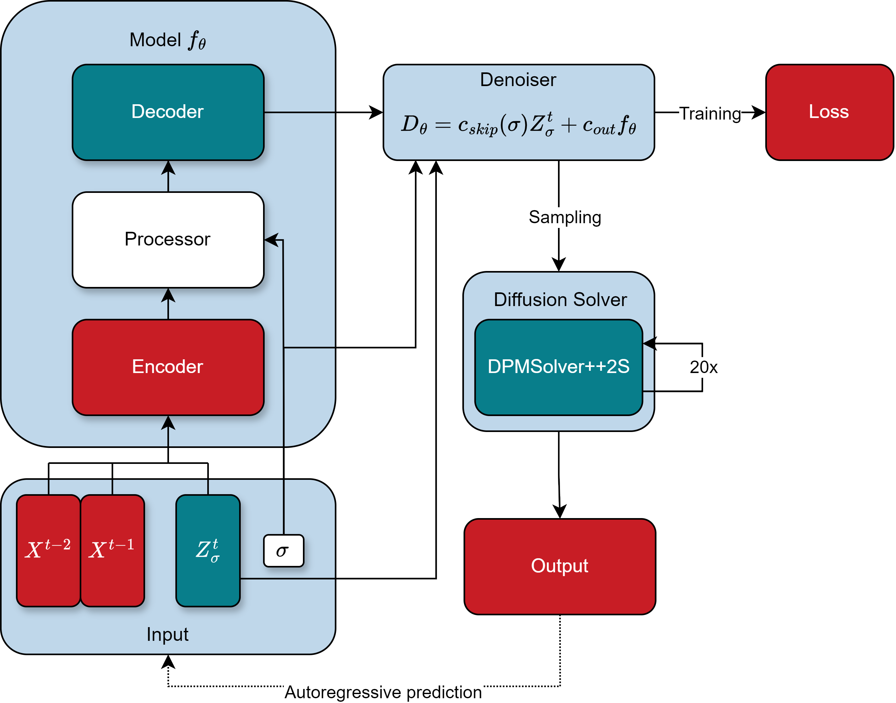
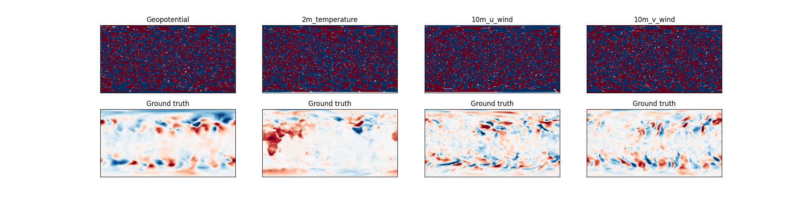

# GenCast

## Overview
This repository offers an unofficial implementation of [GenCast](https://arxiv.org/abs/2312.15796), a cutting-edge model designed to enhance weather forecasting accuracy. GenCast integrates diffusion models, sparse transformers, and graph neural networks (GNNs) to improve upon the GraphCast model with a score-based generative approach. This innovative combination aims to revolutionize weather prediction, significantly contributing to climate research and mitigation efforts. Additionally, GenCast supports ensemble predictions to assess the probability of extreme weather events.

Below is an illustration of the full model architecture:

<p align="center" width="100%">
    
</p>

After 20 epochs, the diffusion process for generating low resolution (128x64) residuals predictions, looks like this:

<p align="center" width="100%">
    
</p>

## The Denoiser
### Description
The core component of GenCast i is the `Denoiser` module: it takes as inputs the previous two timesteps, the corrupted target residual, and the
noise level, and outputs the denoised predictions. The `Denoiser` operates as follows:
- initializes the graph using the `GraphBuilder` class,
- combines `encoder`, `processor`, and `decoder`,
- preconditions inputs and outputs on the noise levels using the parametrization from [Karras et al. (2022)](https://arxiv.org/abs/2206.00364).

The code is modular, allowing for easy swapping of the graph, encoder, processor, and decoder with custom architectures. The main arguments are:
- `grid_lon` (np.ndarray): array of longitudes.
- `grid_lat` (np.ndarray): array of latitudes.
- `input_features_dim` (int): dimension of the input features for a single timestep.
- `output_features_dim` (int): dimension of the target features.
- `hidden_dims` (list[int], optional): list of dimensions for the hidden layers in the MLPs used in GenCast. This also determines the latent dimension. Defaults to [512, 512].
- `num_blocks` (int, optional): number of transformer blocks in Processor. Defaults to 16.
- `num_heads` (int, optional): number of heads for each transformer. Defaults to 4.
- `splits` (int, optional): number of time to split the icosphere during graph building. Defaults to 5.
- `num_hops` (int, optional): the transformes will attention to the (2^num_hops)-neighbours of each node. Defaults to 16.
- `device` (torch.device, optional): device on which we want to build graph. Defaults to torch.device("cpu").
- `sparse` (bool): if true the processor will apply Sparse Attention using DGL backend. Defaults to False.
- `use_edges_features` (bool): if true use mesh edges features inside the Processor. Defaults to True.
- `scale_factor` (float): the message in the Encoder is multiplied by the scale factor. Defaults to 1.0.

> [!NOTE]
> If the graph has many edges, setting `sparse = True` may perform better in terms of memory and speed. Note that `sparse = False` uses PyG as the backend, while `sparse = True` uses DGL. The two implementations are not exactly equivalent: the former is described in the paper _"Masked Label Prediction: Unified Message Passing Model for Semi-Supervised Classification"_ and can also handle edge features, while the latter is a classical transformer that performs multi-head attention utilizing the mask's sparsity and does not include edge features in the computations.

> [!WARNING]
> The sparse implementation currently does not support `Float16/BFloat16` precision.

> [!NOTE]
> To fine-tune a pretrained model with a higher resolution dataset, the `scale_factor` should be set accordingly. For example: if the starting resolution is 1 deg and the final resolution is 0.25 deg, then the scale factor is 1/16.

### Example of usage
```python
import torch
import numpy as np
from graph_weather.models.gencast import Denoiser

grid_lat = np.arange(-90, 90, 1)
grid_lon = np.arange(0, 360, 1)
input_features_dim = 10
output_features_dim = 5
batch_size = 16

denoiser = Denoiser(
        grid_lon=grid_lon,
        grid_lat=grid_lat,
        input_features_dim=input_features_dim,
        output_features_dim=output_features_dim,
        hidden_dims=[32, 32],
        num_blocks=8,
        num_heads=4,
        splits=4,
        num_hops=8,
        device=torch.device("cpu"),
        sparse=True,
        use_edges_features=False,
    ).eval()

corrupted_targets = torch.randn((batch_size, len(grid_lon), len(grid_lat), output_features_dim))
prev_inputs = torch.randn((batch_size, len(grid_lon), len(grid_lat), 2 * input_features_dim))
noise_levels = torch.rand((batch_size, 1))

preds = denoiser(
        corrupted_targets=corrupted_targets, prev_inputs=prev_inputs, noise_levels=noise_levels
        )
```
## The Sampler
The sampler employs the second-order `DPMSolver++2S` solver, augmented with stochastic churn and noise inflation techniques from [Karras et al. (2022)](https://arxiv.org/abs/2206.00364), to introduce additional stochasticity into the sampling process. When conditioning on previous timesteps, it follows the Conditional Denoising Estimator approach as outlined by Batzolis et al. (2021).

### Example of usage
```python
import torch
import numpy as np
from graph_weather.models.gencast import Sampler, Denoiser

grid_lat = np.arange(-90, 90, 1)
grid_lon = np.arange(0, 360, 1)
input_features_dim = 10
output_features_dim = 5

denoiser = Denoiser(
        grid_lon=grid_lon,
        grid_lat=grid_lat,
        input_features_dim=input_features_dim,
        output_features_dim=output_features_dim,
        hidden_dims=[16, 32],
        num_blocks=3,
        num_heads=4,
        splits=0,
        num_hops=1,
        device=torch.device("cpu"),
    ).eval()

prev_inputs = torch.randn((1, len(grid_lon), len(grid_lat), 2 * input_features_dim))

sampler = Sampler()
preds = sampler.sample(denoiser, prev_inputs)
```
> [!NOTE]
> The Sampler class supports modifying all the sampling parameters ($S_{churn}$, $S_{noise}$, $\sigma_{max}$, $\sigma_{min}$ ...). The defaults values are detailed in Gencast's paper.

## Training
The script `train.py` provides a basic setup for training the model. It follows guidelines from GraphCast and GenCast, combining a linear warmup phase with a cosine scheduler. The script supports multi-device DDP training, gradient accumulation, and WandB logging.
